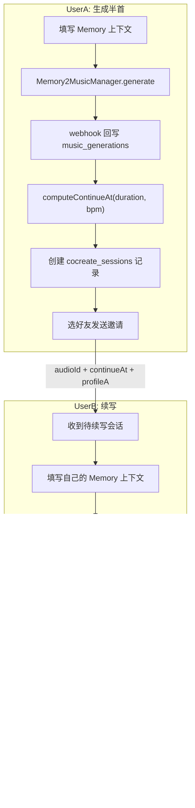

# 共创歌曲功能实现计划

## 数据流




## 阶段 0: Supabase 建表与字段变更

需要在 Supabase Dashboard 执行的 SQL（不是代码文件，实施时提供完整 SQL 脚本）：

1. `**profiles` 表** -- `id (UUID PK -> auth.users)`, `display_name`, `avatar_url`, `friend_code (UNIQUE 8位)`, `created_at`, `updated_at`；RLS: 所有人可读，仅本人可改
2. `**friendships` 表** -- `id`, `user_id`, `friend_id`, `status (pending/accepted/declined/blocked)`, `created_at`；UNIQUE(user_id, friend_id)；RLS: 参与双方可读，发起方可插入，被加方可更新 status
3. `**cocreate_sessions` 表** -- `id`, `creator_id`, `invitee_id`, `status (half_ready/invited/extending/completed/expired)`, `source_task_id`, `suno_audio_id`, `continue_at_sec`, `model`, `profile_a (JSONB)`, `extend_task_id`, `profile_b (JSONB)`, `created_at`, `expires_at`
4. `**music_generations` 加字段** -- `continue_at_sec DOUBLE PRECISION`, `parent_audio_id TEXT`, `cocreate_session_id UUID`, `duration DOUBLE PRECISION`
5. 提供 `upsert_profile` RPC 用于登录后自动创建/更新 profile
6. 提供 `find_user_by_friend_code` RPC 用于好友码查人

清理：检查 Dashboard 中已有的废弃占位表，能合并则合并，否则 DROP。

## 阶段 1: Cocreate 模型层

在 [Core/Models/Cocreate/](Core/Models/Cocreate/) 下新建 3 个文件：

- `**MusicExtendRequest.swift`** -- 对应 Suno extend API 的请求体：`defaultParamFlag`, `audioId`, `model`, `callBackUrl`, `prompt?`, `style?`, `title?`, `continueAt?`, `negativeTags?`, `vocalGender?`, `styleWeight?`, `weirdnessConstraint?`, `audioWeight?`。实现 `Codable`。
- `**CocreateSession.swift**` -- 共创会话模型，包含 `Status` 枚举、`profileA`/`profileB` 快照、`sourceTaskId`、`sunoAudioId`、`continueAtSec` 等。
- `**CocreateProfileSnapshot.swift**` -- 轻量参数快照：`language?`, `instrumental?`, `style?`, `title?`, `prompt?`, `bpm?`, `vocalGender?`, `locationName?`, `weather?`, `healthQuadrant?`。

修改 [Core/Models/GeneratedMusic.swift](Core/Models/GeneratedMusic.swift)：新增 `var continueAtSec: Double?` 字段。

修改 [Core/Models/MusicGenerationRequest.swift](Core/Models/MusicGenerationRequest.swift)：`SunoModel` 枚举增加 `case v5_5 = "V5_5"`。

## 阶段 2: SunoDirectService 增加 extend

修改 [Core/Services/music_related/SunoDirectService.swift](Core/Services/music_related/SunoDirectService.swift)：

新增 `func extendMusic(request: MusicExtendRequest) async throws -> String`：

- `POST /api/v1/generate/extend`
- 请求头与 `generateMusic` 一致
- 响应结构复用 `MusicGenerationResponse`（返回 `taskId`）

修改 [Core/Services/music_related/suno-webhook.ts](Core/Services/music_related/suno-webhook.ts)：

- 在 `callbackType === 'complete'` 分支中，额外写入 `duration: musicData.duration`

## 阶段 3: 好友系统 Service

新建 [Core/Services/User_related/FriendService.swift](Core/Services/User_related/FriendService.swift)：

```swift
class FriendService {
    static let shared = FriendService()
    // func ensureProfile() async throws        -- 登录后 upsert profile
    // func getMyFriendCode() async throws -> String
    // func searchByFriendCode(_ code: String) async throws -> FriendProfile?
    // func sendFriendRequest(to userId: UUID) async throws
    // func acceptRequest(_ friendshipId: UUID) async throws
    // func declineRequest(_ friendshipId: UUID) async throws
    // func loadFriends() async throws -> [FriendProfile]
    // func loadPendingRequests() async throws -> [FriendRequest]
}
```

辅助模型 `FriendProfile` 和 `FriendRequest` 可以写在同一文件或拆出。

## 阶段 4: 共创会话 Service

新建 [Core/Services/music_related/CocreateService.swift](Core/Services/music_related/CocreateService.swift)：

```swift
class CocreateService {
    static let shared = CocreateService()
    // func createSession(sourceTaskId:, sunoAudioId:, continueAtSec:, model:, profileA:) async throws -> CocreateSession
    // func inviteFriend(sessionId: UUID, friendId: UUID) async throws
    // func loadInvitedSessions(for userId: UUID) async throws -> [CocreateSession]
    // func loadMySessions(for userId: UUID) async throws -> [CocreateSession]
    // func updateSessionForExtend(sessionId: UUID, extendTaskId: String, profileB:) async throws
    // func markCompleted(sessionId: UUID) async throws
}
```

## 阶段 5: CocreateExtendManager (B 端编排)

新建 [Core/Managers/CocreateExtendManager.swift](Core/Managers/CocreateExtendManager.swift)：

编排 B 端续写全流程：

1. 构建 `MemoryMusicContext`（B 的输入）
2. LLM 生成 B 的 `prompt/style/title`
3. `mergeParams`：B 缺省字段继承 A 的 `profileA`；model/instrumental 强制与 A 一致；BPM 冲突时在 prompt 里写过渡引导
4. 构建 `MusicExtendRequest`（`defaultParamFlag: true`, `audioId`, `continueAt`, 合并后的 prompt/style/title）
5. 调用 `SunoDirectService.extendMusic`
6. 在 `music_generations` 创建记录（`source: "cocreate"`, `parent_audio_id`, `cocreate_session_id`）
7. Realtime + 轮询等待完成（复用 `MusicDatabaseService` 现有模式）

包含 `computeContinueAt(totalDuration:bpm:targetRatio:)` 静态方法：按 BPM 算 4/4 拍小节边界。

## 阶段 6: MusicDatabaseService 适配

修改 [Core/Services/music_related/MusicDatabaseService.swift](Core/Services/music_related/MusicDatabaseService.swift)：

- `createInitialRecord` 增加可选参数 `continueAtSec: Double?`, `parentAudioId: String?`, `cocreateSessionId: UUID?`
- `parseGeneratedMusic` 增加对 `continue_at_sec`, `duration` 字段的解析，写入 `GeneratedMusic`

## 阶段 7: PlayerManager 半首限制

修改 [Core/Managers/PlayerManager.swift](Core/Managers/PlayerManager.swift)：

在 `startProgressTracking` 的定时回调里：

- 如果 `currentMusic?.continueAtSec` 非 nil，则 `totalDuration` 显示为该值
- 播放到 `continueAtSec` 时自动暂停并 seek 回 0
- `playbackProgress` 按 `continueAtSec` 而非实际总时长计算

## 阶段 8: ShareViewModel + ShareView

新建 [Features/Share/ShareViewModel.swift](Features/Share/ShareViewModel.swift)：

Published 状态分三组：

- 好友管理：`friends`, `pendingRequests`, `friendCodeInput`, `myFriendCode`
- A 端共创：`isGeneratingHalf`, `halfSongResult`, `selectedFriend`，以及 Memory 输入字段（`prompt`, `selectedImage`, `instrumentalOnly`, `language`, `usePsychologicalProfile` 等）
- B 端续写：`pendingSessions`, `isExtending`, B 端 Memory 输入字段

依赖注入：`FriendService`, `CocreateService`, `Memory2MusicManager`, `CocreateExtendManager`, `MusicDatabaseService`

重写 [Features/Share/ShareView.swift](Features/Share/ShareView.swift)：

三个 Section 的 List 布局：

1. Friends：我的好友码展示 + 输入码添加好友 + 好友列表 + 待处理请求
2. Start Cocreate（A 端）：Memory 输入控件（语言/vocal/health/location/图片/文字） + 生成按钮 + 半首预览 + 选好友发送
3. Continue a Song（B 端）：待续写会话列表 + 点击进入续写（同样的 Memory 输入 + extend 按钮）

