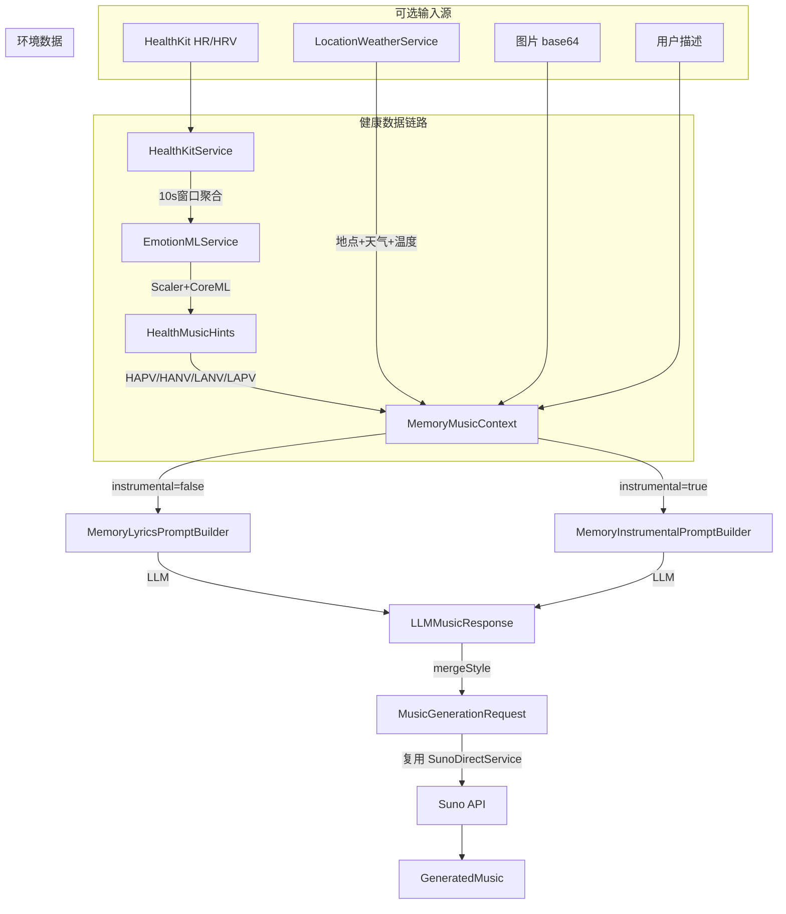

# Memory Music Generation

## 数据流总览

## 不动的文件（直接复用）

- [MusicGenerationRequest.swift](Core/Models/MusicGenerationRequest.swift)
- [MusicGenerationResponse.swift](Core/Models/MusicGenerationResponse.swift)
- [MusicTaskStatusResponse.swift](Core/Models/MusicTaskStatusResponse.swift)
- [GeneratedMusic.swift](Core/Models/GeneratedMusic.swift)
- [LyricLine.swift](Core/Models/LyricLine.swift)
- [SunoDirectService.swift](Core/Services/music_related/SunoDirectService.swift)
- [MusicServiceProtocol.swift](Core/Services/music_related/MusicServiceProtocol.swift)
- [MusicBaseManager.swift](Core/Managers/MusicBaseManager.swift)
- [OpenAILyricsService.swift](Core/Services/music_related/OpenAILyricsService.swift)（LLM 调用层不变，只是传入不同的 `LyricsGenerationRequest`）

将 `LyricsGenerationResponse` 改名为 `LLMMusicResponse`（结构不变，只改名 + 更新所有引用）。`LLMServiceProtocol` 接口不变。

## 新建文件清单

### 1. `Core/Models/Memory_Mode/` 下新建（与 .mlmodel 同目录）

- **MemoryMusicContext.swift** -- 全 Optional 输入上下文聚合
  - `photo: String?`, `story: String?`, `language: String`, `instrumentalOnly: Bool`
  - `heartRate: Double?`, `hrv: Double?`, `healthHints: HealthMusicHints?`
  - `locationName: String?`, `weather: String?`, `temperature: Double?`
- **HealthMusicHints.swift** -- Core ML 推理输出
  - `valence: Double`, `arousal: Double`
  - `quadrant: EmotionQuadrant`（枚举 HAPV/HANV/LANV/LAPV）
  - `styleFragment: String`（对应四象限文本："Fast Tempo, Major Mode, High Energy" 等）
- **MemoryLyricsPromptBuilder.swift** -- 歌词版 prompt 构建器
  - `static func build(from context: MemoryMusicContext) -> String`
  - 按条件拼块：角色说明 + (图片分析指令)? + (故事)? + (HR/HRV情绪上下文)? + (地点天气)? + 输出格式
  - 输出仍要求 LLM 返回 `{"title","style","prompt"}` JSON
- **MemoryInstrumentalPromptBuilder.swift** -- 纯音乐版 prompt 构建器
  - `static func build(from context: MemoryMusicContext) -> String`
  - 不要求歌词，只输出 `{"title","style","prompt":""}` 但 style 要极详细
  - 健康/环境信息直接影响 style 描述

### 2. `Core/Services/` 下新建

- **LocationWeatherService.swift** -- 共享单例，抽自 `LightViewModel` 里的 CLLocation + WeatherKit 逻辑
  - `@MainActor class LocationWeatherService: NSObject, ObservableObject, CLLocationManagerDelegate`
  - `@Published var locationName: String?`, `weather: String?`, `temperature: Double?`, `symbolName: String?`
  - `func requestOnce() async` -- 单次定位 + 拉天气 + 反地理编码
  - Light 和 Memory 都注入这个 service
- **HealthKitService.swift** -- HealthKit 授权 + 10s 窗口 HR/HRV 读取
  - `class HealthKitService`
  - `func requestAuthorization() async throws`
  - `func fetchRecentHRAndHRV(windowSeconds: Double = 10) async throws -> (heartRate: Double, hrv: Double)?`
  - 内部用 `HKStatisticsQuery` / `HKSampleQuery` 取最近样本再聚合
- **EmotionMLService.swift** -- Scaler + Core ML 推理 + 四象限
  - `class EmotionMLService`
  - 硬编码 scaler 常量（来自你的文档：HR data_min=34.59, data_range=1501.41; HRV data_min=0, data_range=296.875）
  - `func predict(heartRate: Double, hrv: Double) throws -> HealthMusicHints`
  - 内部：clip -> scale -> model_arousal + model_valence -> clip output -> 四象限判定 -> 返回 HealthMusicHints

### 3. `Core/Managers/` 下新建

- **Memory2MusicManager.swift** -- Memory 生成协调器
  - 依赖：`MusicBaseManager`, `LLMServiceProtocol`, `HealthKitService`, `EmotionMLService`, `LocationWeatherService`
  - `func generate(context: MemoryMusicContext, onProgress: (String) -> Void) async throws -> GeneratedMusic`
  - 流程：
    1. 若有 HR/HRV → `EmotionMLService.predict()` → 填入 `context.healthHints`
    2. 按 `instrumentalOnly` 选择 LyricsPromptBuilder 或 InstrumentalPromptBuilder
    3. 构建 `LyricsGenerationRequest`（复用现有类型，`buildPrompt()` 改为由 Builder 产出的字符串）
    4. 调 LLM → `LLMMusicResponse`
    5. `mergeStyle()`：将健康 styleFragment + 环境标签合并进 style
    6. 构建 `MusicGenerationRequest` → `baseManager.startMusicTask()` → Supabase + 轮询（同 Photo2MusicManager 模式）

### 4. 权限配置

- **Butterfly V3Release.entitlements** + **Butterfly V3.entitlements** -- 添加 `com.apple.developer.healthkit` + `com.apple.developer.healthkit.access`（read: heart_rate, heart_rate_variability_sdnn）
- **App/Info.plist** -- 添加 `NSHealthShareUsageDescription`

### 5. `LLMServiceProtocol` 的适配

当前协议只接受 `LyricsGenerationRequest`。Memory 的 prompt 由 Builder 生成，但仍需通过同一个 `OpenAILyricsService` 发送。两种做法：

- **方案 A**（推荐，改动最小）：给 `LyricsGenerationRequest` 加一个 `init(rawPrompt:photo:photoPresent:)`，让 Builder 的输出直接注入，`buildPrompt()` 在有 rawPrompt 时直接返回它
- **方案 B**：在协议上加一个 `generateFromPrompt(prompt: String, photo: String?) async throws -> LyricsGenerationResponse` 方法

方案 A 只需在现有 struct 上加一个可选字段 + init，不改协议，不改 OpenAILyricsService。

## 提示词草稿位置

两份 prompt 模板会写在：

- `Core/Models/Memory_Mode/MemoryLyricsPromptBuilder.swift`（歌词版）
- `Core/Models/Memory_Mode/MemoryInstrumentalPromptBuilder.swift`（纯音乐版）

以多行字符串写在 Swift 文件里，你可以直接在文件内修改措辞。

## LightViewModel 的后续调整（本次可选）

抽出 `LocationWeatherService` 后，`LightViewModel` 中的 CLLocation/WeatherKit 代码可以替换为注入 shared service，但这不阻塞 Memory 功能，可以后续再做。